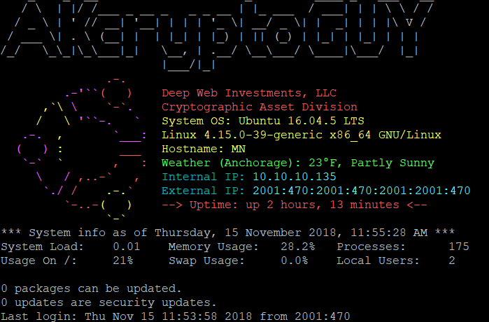

# motd
update motd on ubuntu-server

This script replaces the standard Ubuntu welcome message with a Helium logo and useful server information through modifying the MOTD files on the VPS.

**Usage:**

As root:
```
git clone https://github.com/akcryoptoguy/motd.git
cd motd
bash install-motd.sh
```

Changes will take effect immediately, so there is no need to reboot the VPS. Example:





Use at your own risk :)

To update your location for weather, update "weathercity" and "weatherurl" with your nearest major city supported by AccuWeather. You can also personalize other variables.

```
sudo nano /etc/update-motd.d/00-header
```

With grandest thanks to Teela.
